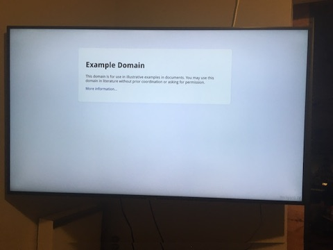
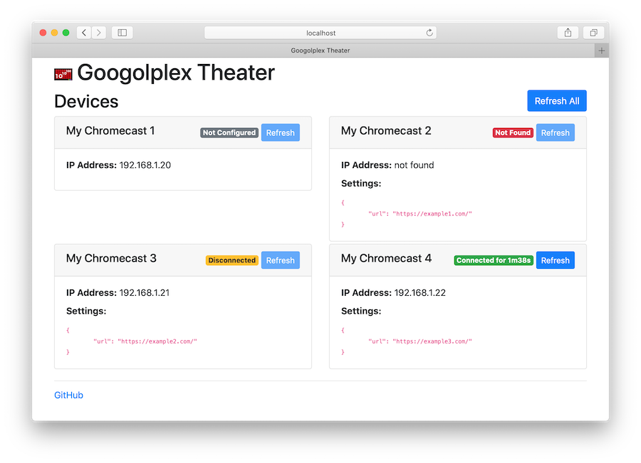

# googolplex-theater
by yuzawa-san


[](https://travis-ci.org/yuzawa-san/googolplex-theater)
[](https://codecov.io/gh/yuzawa-san/googolplex-theater)

[](https://github.com/yuzawa-san/googolplex-theater/releases)
[](https://hub.docker.com/repository/docker/yuzawa/googolplex-theater/)
[](https://hub.docker.com/repository/docker/yuzawa/googolplex-theater/)
[](https://github.com/yuzawa-san/googolplex-theater/releases)


Persistently maintain multiple Chromecast devices on you local network without using your browser.
Ideal for digital signage applications.
Originally developed to display statistics dashboards.



There are several tools and libraries out there (see below), but this project is intended to be very minimalist.
There is a simple web UI to check device info and trigger refreshes.



There is no backing database or database dependencies, rather there is a simple JSON config file which is watched for changes.
The JSON configuration is conveyed to the receiver application, which by default accepts url to display in an IFRAME.
The receiver application can be customized easily to suit your needs.
The application will try to reconnect if a session is ended for whatever reason.

## Requirements

This application has very minimal runtime requirements:

* Java runtime version 8 or later.
* Linux or MacOS is preferred. Windows appears to work, but the maintainer lacks access to the hardware to test, so your mileage may vary.

There are certain requirements for networking which are beyond the realm of this project, but should be noted:

* This application must run on the same network as your Chromecasts.
* Multicast DNS must work on your network and on the machine you run the application on. This is how the devices and the application discover each other.
* IMPORTANT: URLs must be HTTPS and must not [deny framing](https://developer.mozilla.org/en-US/docs/Web/HTTP/Headers/X-Frame-Options) This is a limit of using an IFRAME to display content.
* It is strongly recommended to use a piece of dedicated hardware (like the inexpensive Raspberry Pi) to run this application.

Development requirements:

* JDK 8 or later. The [gradle wrapper](https://docs.gradle.org/current/userguide/gradle_wrapper.html) is used to build this application and is already included.

NOTE: The Java 8 is the minimum target version to support some older versions of 
Raspberry Pi OS (Raspbian). This may be subject to change.

## Installation

There are few options for installation:

* Download a Debian package (Respberry Pi compatible) from the [releases page](https://github.com/yuzawa-san/googolplex-theater/releases).
* Use a Docker image published to Dockerhub.
* Download a [release ZIP archive](https://github.com/yuzawa-san/googolplex-theater/releases) or build the application locally.

### Package Installation

The Raspberry Pi is a cost-effective piece of hardware to run this application, so Raspberry Pi OS (Raspbian) is the main build target for this package.
The package should theoretically work with other Debian distros as well.

Download a Debian package from [the releases page](https://github.com/yuzawa-san/googolplex-theater/releases) using wget or curl. Then install:
```
sudo apt install ./googolplex-theater......deb
```

It may prompt you to install a version of Java.
This automates the installation for the most part, so it is only really necessary to [update your configuration](#usage).
This application is registered as a systemd service, so the `systemctl` and `journalctl` commands are useful for starting, stopping, checking status, tailing logs, etc.

Perhaps this package will be released in the public repositories one day, but manual download is the only option available currently.

### Docker Installation

The application is also available on [dockerhub](https://hub.docker.com/repository/docker/yuzawa/googolplex-theater/).

This may be comparatively easier versus getting a proper Java runtime installed.
This is released in a few common processor architectures: amd64, arm64/v8, arm/v7.
The latter should work for newer Raspberry Pi models with architecture ARMv8-A (64/32-bit).
Nuance: The kernel of Raspberry Pi OS is generally built for 32-bit, so the despite the hardware physically supporting arm64/v8, both the native runtime and docker runtime is pinned to arm/v7.
[Older models](https://en.wikipedia.org/wiki/Raspberry_Pi#Specifications) such as the "Zero" which use older ARM versions are not supported.

To run a specific `VERSION` of the application:
```
docker run --net=host -v /path/to/your/conf:/opt/java-app/conf yuzawa/googolplex-theater:VERSION
```

For the service discovery to work correctly, you will need the `--net=host` option.
There is no safer way to get this working at this point in time.
Sadly, this option does not work in Mac.
If you get warnings about port 5353 being in use, you may need to disable Avahi on Linux.
The `conf` directory is mounted as a docker volume.
This will seamlessly map your local configuration into the Docker runtime.
Arguments like `--help` can be appended onto the end of the `docker run` example above.

It is recommended to wrap your `docker run` in something to keep it running as a daemon or persistent service.

### Manual Installation

Download a ZIP archive from [the releases page](https://github.com/yuzawa-san/googolplex-theater/releases).

Alternatively, clone/download this repo, and run:
```
./gradlew build
```

This will generate the application ZIP archive in `./build/distributions/googolplex-theater-VERSION.zip`

Once you have the ZIP archive, expand it in the desired destination location and `cd` into directory.

To show all options:
```
./bin/googolplex-theater --help
```

To run the application with default settings:
```
./bin/googolplex-theater
```

#### Running as Daemon

To provide resiliency, it is recommended to run the application as a daemon.
See service descriptor files for upstart, systemd, and launchd in the `./service/` directory. They should work with minor modifications. Please refer to their respective installation guides to enable on your system.


## Usage

The cast configuration is defined in `./conf/cast_config.json`.
The location of your configuration can be customized using a command line argument.
The file is automatically watched for changes.
Some example use cases involve using cron and putting your config under version control and pulling from origin periodically, or downloading from S3/web, or updating using rsync/scp.

### Case Study: Grafana Dashboards

The maintainer has used this to show statistics dashboards in a software engineering context.

* Buy a new Raspberry Pi and install the default Raspberry Pi OS (Raspbian).
* Configure and name your Chromecasts.
* Install application Debian package and Java runtime.
* Create one Grafana playlist per device.
* Figure out how to use proper Grafana auth (proxy, token, etc).
* Make your cast config file with each playlist url per device.
* Place the cast config file under version control (git) or store it someplace accessible (http/s3/gcs).
* Add a cron job to pull the cast config file from wherever you stored it (alternatively configure something to push the file to the Raspberry Pi).
* Config is updated periodically as our dashboard needs change. The updates are automatically picked up.
* If a screen needs to be refreshed, one can do so by accessing the web UI exposed port 8000 and hitting a few buttons.

### Using a Custom Receiver

If you wish to customize the behavior of the receiver from just displaying a single URL in an IFRAME, see the example custom receiver in `receiver/custom.html`.

For custom receivers, you will be required to [sign up as a Chromecast developer](https://developers.google.com/cast/docs/registration#RegisterApp) and also configure [devices](https://cast.google.com/publish) for development.

Currently the device name and settings are printed to the screen. Customize the listener handler to do as you wish.

Host your modified file via HTTPS on your hosting provider of choice. Then point your new custom receiver application towards that page's URL.

Pass your APP_ID in as a command line argument when you run, and your receiver will be loaded up.

### Troubleshooting

There may be some issues related to discovering the Chromecast devices on your network.
It is important that the service discovery uses the network interface and IP address attached to the network with the Chromecasts.
The application will make decent attempt to find the proper network interface to use.
There is a chance it may find the wrong interface/address based on your system configration (wireless internet vs ethernet, VPN, ordering).
Some diagnostic information is printed in the application output annotated with `com.jyuzawa.googolplex_theater.mdns.ServiceDiscovery`.
There is a command line argument (`-i`) which allows the desired network interface (by name) or IP address to be provided.

## Contributing

_NOTE: due to COVID-19 the maintainer does not have regular access to the hardware to test this application._

See [CONTRIBUTING.md](contributing.md) for more details.

This is intended to be minimalist and easy to set up, so advanced features are not the goal here. Some other projects listed below may be more suited for your use case.

### TODO

* Raspberry Pi OS package distribution
* Split screen layouts
* Framing proxy (may not be feasible or allowed under HTTPS)

## Related Projects

This application overlaps in functionality with some of these fine projects:

### Protocol implementations
* [node-castv2](https://github.com/thibauts/node-castv2) - nodejs library
* [nodecastor](https://github.com/vincentbernat/nodecastor) - nodejs library
* [chromecast-java-api-v2](https://github.com/vitalidze/chromecast-java-api-v2) - java library
* [pychromecast](https://github.com/balloob/pychromecast) - python library

Foundational work has been done to research how the Chromecast protocol works and these protocol libraries have been developed in a variety of languages. A lot of the headless senders are built off of these.

### Browser Senders
* [dashcast](https://github.com/stestagg/dashcast) - simple dashboard display application 
* [chromecast-dashboard](https://github.com/boombatower/chromecast-dashboard) - similar to dashcast

These applications cast directly from your browser. You may need to have your browser up and running all of the time.

### Headless Senders
* [greenscreen](https://github.com/groupon/greenscreen) - original digital signage implementation
* [multicast](https://github.com/superhawk610/multicast) - a fork/refactor of greenscreen
* [Chromecast-Kiosk](https://github.com/mrothenbuecher/Chromecast-Kiosk) - similar to greenscreen or multicast

These applications cast without a Chrome browser running, rather they utilize the Chromecast protocol to establish a communication session with the devices directly.

This application is most similar to the headless sender projects. It does not use a protocol implementation library.

## Name

It is designed for multiple Chromecasts, rather than a [googol](https://en.wikipedia.org/wiki/Googol) or [googolplex](https://en.wikipedia.org/wiki/Googolplex).
It is from [The Simpsons](https://simpsons.fandom.com/wiki/Springfield_Googolplex_Theatres). The developer made it singular and decided to use the American spelling.
Googol sure does sound like the manufacturer of the Chromecast.